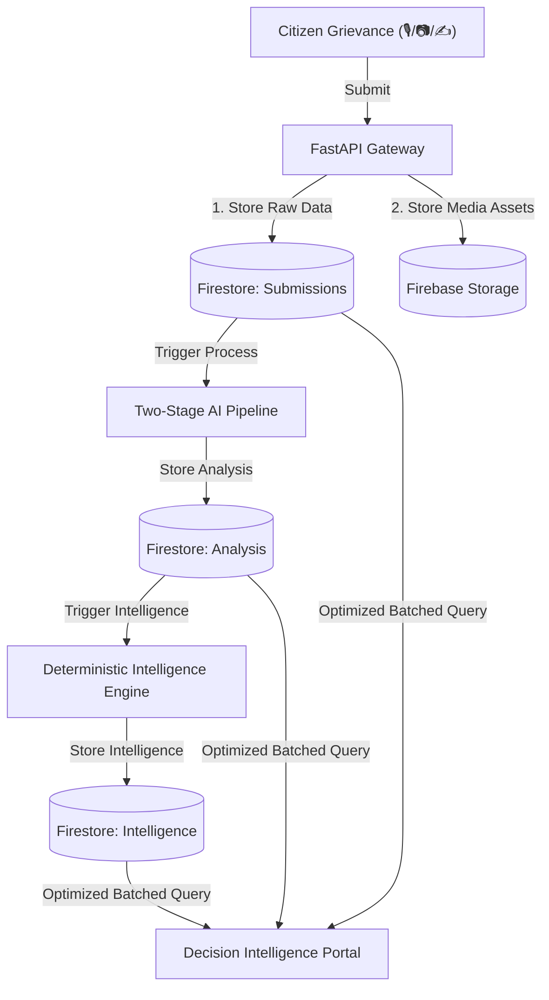
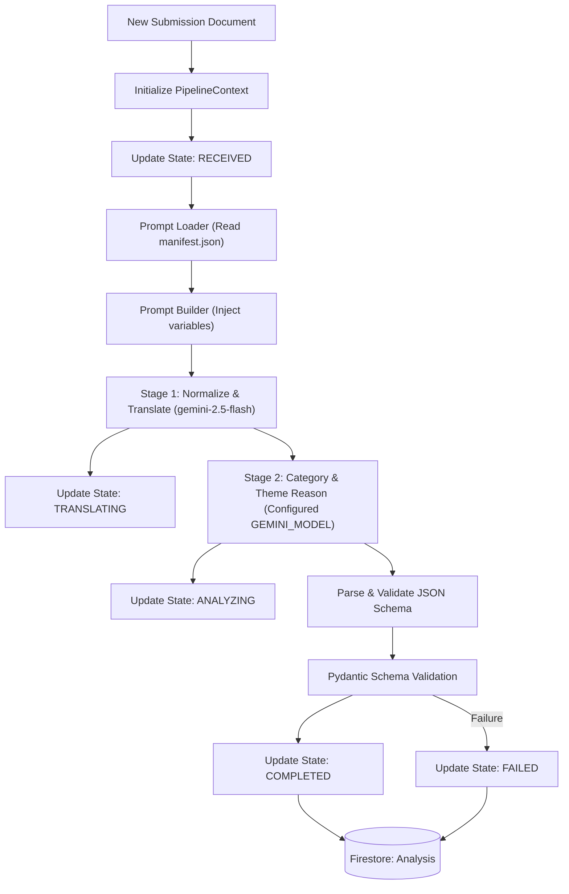
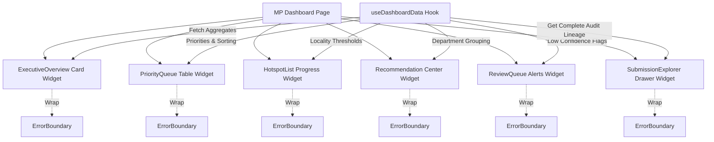

# System Architecture Manual

This document details the high-level, component, and database architectures of the **People's Priorities AI** platform.

---

## 1. High-Level Architecture Flow

The system uses a vertical slice design pattern. Citizen reports flow through stateless controllers into Firestore, which triggers the AI pipeline and intelligence engines to produce decision structures displayed on the Member of Parliament (MP) portal.



---

## 2. AI Translation & Reasoning Pipeline

The AI pipeline isolates generative AI calls, using a shared state context to record state transitions and collect cost metrics.



---

## 3. Decision Portal & Dashboard Widget Flow

Every widget inside the Member of Parliament Dashboard is isolated, wrapping itself in an independent Error Boundary and managing its own lifecycle.



---

## 4. Repository Directory Structure

```
people-priorities-ai/
├── Docs/                    # Architecture Specs & Developer Guides
│   ├── screenshots/         # Captured PNG user interfaces
│   ├── Architecture.md      # This file
│   ├── AI_PIPELINE.md       # AI Analysis manual
│   ├── API_REFERENCE.md     # REST contract docs
│   └── DEPLOYMENT.md        # Environment setup guide
├── backend/                 # FastAPI Backend Service
│   ├── app/
│   │   ├── api/             # API Controllers & routing
│   │   ├── core/            # Config, logger, policy rules
│   │   ├── db/              # Database drivers
│   │   ├── ai/              # Prompt versioning & Gateway
│   │   ├── models/          # Core DB structure maps
│   │   ├── schemas/         # Request/response validators
│   │   ├── repositories/    # Query abstraction wrappers
│   │   └── services/        # Orchestrator flows
│   └── requirements.txt     # Python dependencies
├── frontend/                # React Frontend Service
│   ├── src/
│   │   ├── features/        # Feature slices (dashboard, submission)
│   │   ├── components/      # Common UI components
│   │   ├── hooks/           # Custom React hooks
│   │   └── services/        # Axios API clients
│   └── package.json         # Node.js dependencies
└── shared/                  # Shared JSON validation files
```
