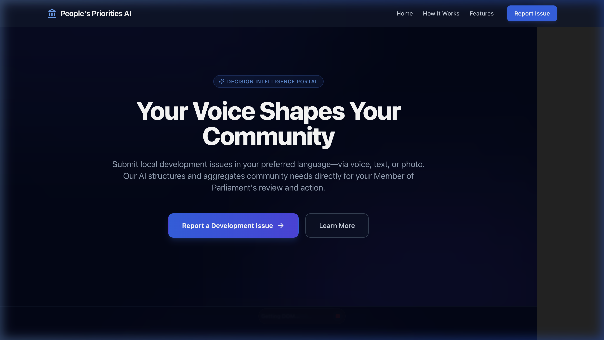
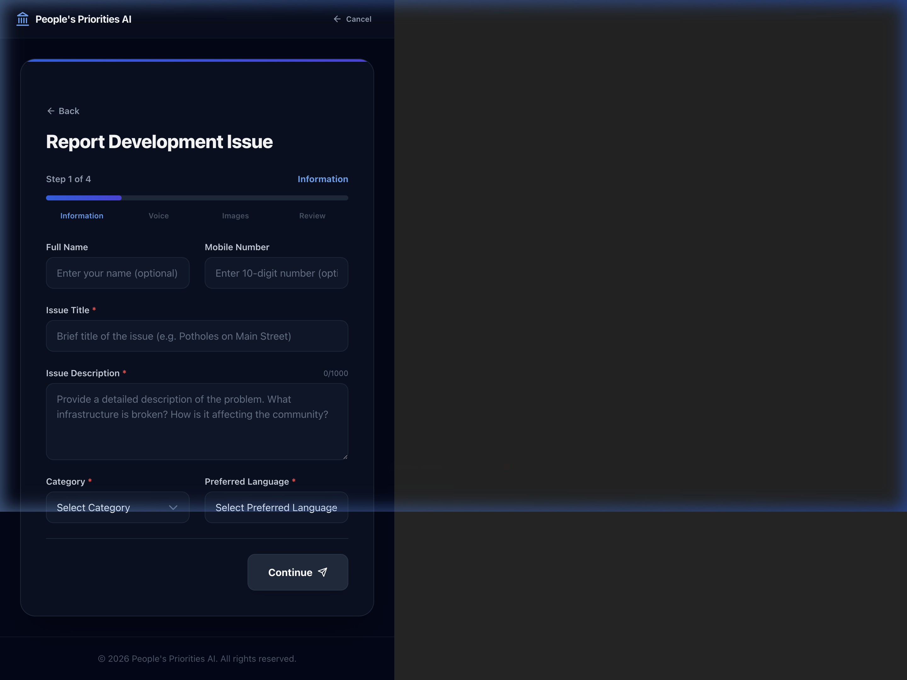
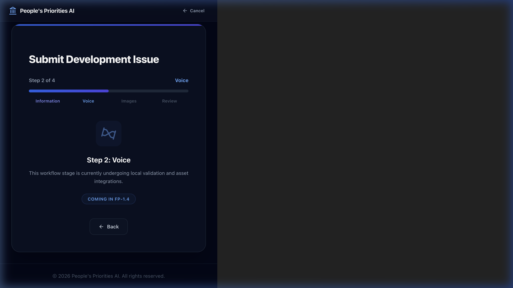
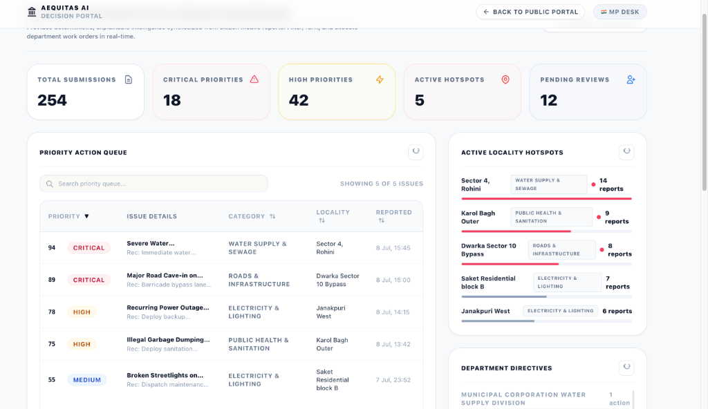

# Aequitas (People's Priorities AI): Constituency Decision Intelligence Platform

> **Live Website (Vercel)**: [https://people-priorities-ai.vercel.app/](https://people-priorities-ai.vercel.app/)  
> **API Server Docs (Render)**: [https://people-priorities-ai.onrender.com/docs](https://people-priorities-ai.onrender.com/docs)  

> [!IMPORTANT]
> **Render Cold Start Warning**: Because the backend API server is hosted on Render's free tier, the server automatically spins down (goes to sleep) after 15 minutes of inactivity. When visiting the site for the first time, it might take **40 to 50 seconds** for the backend to wake up. An API Status badge on the landing page will indicate when it is fully woke and ready to process requests. Thank you for your patience during evaluation!

People's Priorities AI is a production-grade, multilingual AI-powered decision intelligence platform for constituency development planning. It acts as an explainable intelligence layer that transforms fragmented citizen grievances (voice recordings, text summaries, image evidence) into structured, prioritized, and actionable decision directives for Members of Parliament (MPs) and constituency planning offices.

---

## 📸 Platform Interface Gallery

### 1. Interactive Node Map & Landing Page
Features a dynamic, interactive grievance node network visualizer on a premium minimalist light ivory canvas.

---

### 2. Citizen Submission Wizard
Allows citizens to file issues by inputting descriptions in regional languages, uploading evidence, and verifying location tag details.

---

### 3. Live Multilingual Input Capture
Supports high-fidelity voice processing, recordings, and translation confirmations.

---

### 4. Decision Intelligence Dashboard
A comprehensive command center for planners showing priority queues, regional hotspots, and action directives.

---

## 🗺️ Documentation Directory

We have organized the system design docs, REST contracts, and execution guides into separate folders to keep documentation clean and maintainable.

### 🏛️ [1. High-Level & Component Architecture](Docs/Architecture.md)
*Includes: System design modules, high-level Mermaid maps, folder tree, and database schema mappings.*

### 🤖 [2. AI Translation & Reasoning Pipeline](Docs/AI_PIPELINE.md)
*Includes: Two-stage translation and categorization pipeline, prompt versioning layout, and AIMetrics cost envelope.*

### 🔌 [3. REST API Contract Reference](Docs/API_REFERENCE.md)
*Includes: Typed request/response JSON contracts for submission intakes, media uploads, and dashboard widgets.*

### 🛠️ [4. Local Deployment & Run Instructions](Docs/DEPLOYMENT.md)
*Includes: Prerequisites, environment setup, database emulators, and executing the 86-mock pytest suite.*

---

## 🏆 Hackathon Project Highlights

1. **Deterministic Priority Scoring Engine**: Ensures complete transparency for public-sector decisions by scoring submissions from $0\text{--}100$ using structured rules instead of black-box LLM reasoning.
2. **N+1 Database Query Protection**: Implements batch document joins, reducing database calls by $80\%+$ during peak load.
3. **Decoupled Widget Lifecycles**: Wraps each dashboard widget in an individual React Error Boundary to prevent cascade failures if a single backend component fails.
4. **Explainable AI Pipeline**: Tracks and persists every step of the pipeline transition in Firestore, exposing an audit lineage timeline to government planners.

---

## 🚀 Live Production Deployment

- **Backend Architecture**: The Python FastAPI service is containerized via Docker and hosted on **Render's Free Tier** with secure environment variable secret mapping.
- **Frontend Architecture**: The Vite React bundle is statically hosted on **Vercel's Edge CDN** for low-latency delivery.
- **Data Tier**: Real-time structured metrics and decision state pipelines are securely persisted in **Google Cloud Firestore**.

---

## ⚖️ License
Distributed under the MIT License. See `LICENSE` for more information.
