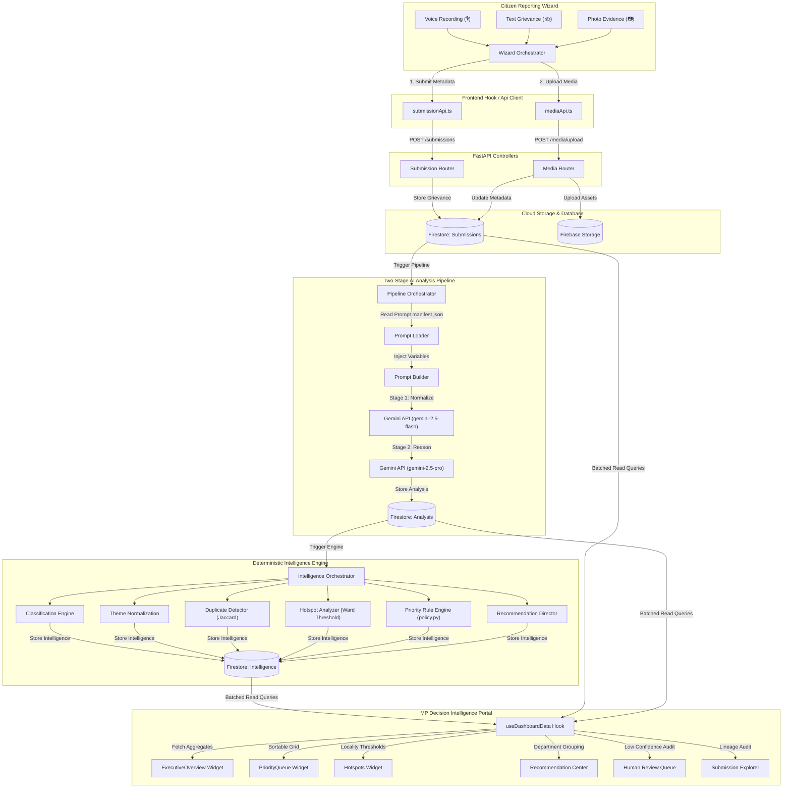

# People's Priorities AI: Constituency Decision Intelligence Platform

People's Priorities AI is a production-grade, multilingual AI-powered decision intelligence platform for constituency development planning. It acts as an explainable intelligence layer that transforms fragmented citizen grievances (voice recordings, text summaries, image evidence) into structured, prioritized, and actionable decision directives for Members of Parliament (MPs) and constituency planning offices.

---

## 1. End-to-End System Architecture

The platform is designed around a strictly decoupled **vertical slice architecture** split into a stateless REST API layer, a transient workflow orchestration engine, an isolated prompt-versioned AI Gateway, a deterministic rule-based Intelligence Engine, and a modular widget-based Decision Portal.

### Complete Data Flow Diagram



---

## 2. Core Technical Architecture Modules

### A. Frontend Submission Wizard & State Transition
- **Pure Stateful Hook (`useSubmissionWorkflow.ts`)**: Manages step transitions sequentially (Information $\to$ Voice $\to$ Images $\to$ Location $\to$ Review $\to$ Success) without embedding network details.
- **Workflow Orchestrator (`submissionWorkflow.ts`)**: Decouples component layout from navigation logic. It executes sequential submission: registers the submission record first, uploads binary media files second, and updates references third, preventing incomplete network transactions.

### B. Two-Stage AI Analysis Pipeline
- **API Gateway (`AIGateway`)**: Wraps LLM client interactions with dedicated exceptions (`AIGatewayException`, `PromptException`). Collects token counts, latency, and cost inside a typed `AIMetrics` envelope.
- **Prompt Versioning**: Prompts are stored under versioned folders (`backend/app/ai/prompts/v1/`) with a `manifest.json` catalog declaring active prompt roles.
- **Shared Pipeline Context**: The `PipelineContext` flows through all stages of analysis, recording state transitions (e.g., `RECEIVED`, `TRANSLATING`, `ANALYZING`, `COMPLETED`, `FAILED`) to Firestore in real-time.
- **Stage 1 (Normalize)**: Standardizes transcription formatting and translates regional Indian languages to English.
- **Stage 2 (Reason)**: Infers category classifications, extracts key thematic keywords, evaluates confidence, and produces structural reasoning.

### C. Bounded Intelligence Engine
Operates completely deterministically without generative AI models to ensure transparency, reproducibility, and explainability for government officials.
- **Classification Engine**: Re-evaluates classifications and flags edge cases.
- **Theme Normalization**: Maps raw AI tags to normalized, pre-approved government policy taxonomies.
- **Duplicate Detector**: Performs Jaccard coefficient similarity checks against preceding ward records to merge repeating report clusters.
- **Hotspot Analyzer**: Aggregates submissions by locality. Flags a ward as a **Hotspot** if active reports exceed a threshold of `5` (configurable via `HOTSPOT_THRESHOLD` in `config.py`) within a `90-day` lookback.
- **Priority Rule Engine (`rule_engine.py`)**: Computes priority scores ($0\text{--}100$) by executing discrete policy rules (defined in `policy.py`) weighing:
  - Inferred Category Severity ($30\%$)
  - Issue Reporting Frequency ($25\%$)
  - Location Hotspot Status ($20\%$)
  - Designated Priority Location Weight ($15\%$)
  - Inferred AI Confidence Level ($10\%$)
- **Recommendation Director**: Generates action directives and routes them to specific municipal departments.

### D. Decision Portal & Explainable Explorer
- **Widget Isolation**: Each widget operates as an independent React module.
- **Error Boundaries**: Every dashboard widget is wrapped with a custom `DashboardErrorBoundary` to prevent single-component crash propagation.
- **Independent Lifecycles**: Widgets manage their own loading, error, and manual `refetch()` state via the unified `useDashboardData()` custom hook.
- **Timeline Explorer**: Renders the complete auditing lineage of a report from intake timestamps, through intermediate LLM summaries, to the final priority score breakdown showing the exact points assigned by each rule.

---

## 3. Backend REST API Contract Reference

The backend exposes the following typed JSON APIs:

### 1. Grievance Intake & Upload
#### `POST /api/v1/submissions`
- **Request Body**:
  ```json
  {
    "version": "1.0.0",
    "createdAt": "2026-07-07T14:50:00Z",
    "information": {
      "title": "Broken Streetlight",
      "description": "The streetlamp on MG Road has been broken for 3 days.",
      "category": "Electricity",
      "language": "en"
    },
    "voice": {
      "duration": 12.5
    },
    "images": [
      {
        "filename": "lamp.jpg",
        "mimeType": "image/jpeg",
        "size": 150000
      }
    ],
    "location": {
      "latitude": 12.97159,
      "longitude": 77.59456,
      "accuracy": 4.5,
      "locality": "MG Road",
      "ward": "Ward 12"
    }
  }
  ```
- **Response Body**:
  ```json
  {
    "success": true,
    "requestId": "SUB-20260707-145000",
    "status": "received",
    "data": {
      "submissionId": "sub-doc-uuid"
    }
  }
  ```

#### `POST /api/v1/media/upload`
- **Form Data**:
  - `file`: Binary file upload
  - `submissionId`: UUID string
  - `mediaType`: `"image"` | `"voice"`
  - `filename`: File name string
- **Response Body**:
  ```json
  {
    "success": true,
    "requestId": "SUB-20260707-145001",
    "data": {
      "mediaUrl": "https://storage.googleapis.com/bucket/sub-doc-uuid/filename.jpg"
    }
  }
  ```

### 2. MP Decision Intelligence Portal APIs
#### `GET /api/v1/dashboard/summary`
- **Response Body**:
  ```json
  {
    "success": true,
    "requestId": "SUB-20260707-145002",
    "data": {
      "totalSubmissions": 142,
      "highPriorityCount": 18,
      "criticalPriorityCount": 5,
      "hotspotsCount": 3,
      "pendingReviewCount": 12
    }
  }
  ```

#### `GET /api/v1/dashboard/priorities`
- **Response Body**:
  ```json
  {
    "success": true,
    "requestId": "SUB-20260707-145003",
    "data": [
      {
        "submissionId": "sub-uuid-1",
        "title": "Water leakage in Ward 2",
        "locality": "MG Road",
        "category": "Water Supply",
        "priorityScore": 88,
        "priorityLevel": "CRITICAL",
        "recommendedAction": "Deploy pipeline emergency repair team.",
        "processedAt": "2026-07-07T14:00:00Z"
      }
    ]
  }
  ```

#### `GET /api/v1/dashboard/submissions/{id}`
- **Response Body**:
  ```json
  {
    "success": true,
    "requestId": "SUB-20260707-145004",
    "data": {
      "submission": {
        "id": "sub-uuid-1",
        "status": "RECEIVED",
        "information": { "category": "Water Supply", "language": "en" }
      },
      "analysis": {
        "summary": "Main water pipeline leak on MG road causing flooded lanes.",
        "confidence": 0.95,
        "themes": ["Water Supply", "Infrastructure Damage"],
        "processedAt": "2026-07-07T14:00:00Z"
      },
      "intelligence": {
        "priorityScore": 88,
        "priorityLevel": "CRITICAL",
        "recommendedAction": "Deploy pipeline emergency repair team.",
        "recommendedDepartment": "Water Resources Development Board",
        "urgency": "Immediate",
        "isHotspot": true,
        "isDuplicate": false,
        "generatedAt": "2026-07-07T14:00:05Z"
      }
    }
  }
  ```

---

## 4. Local Development & Test Execution Guide

### Prerequisites
- **Node.js**: v18.0.0+
- **Python**: v3.11.0+
- **Firebase Emulator / GCP Credentials**: Google Firestore + Firebase Cloud Storage emulator configured or real project keys supplied in `.env`.

### Step-by-Step Local Setup

1. **Activate Python Virtual Environment & Install Dependencies**:
   ```bash
   cd backend
   python3 -m venv .venv
   source .venv/bin/activate
   pip install -r requirements.txt
   ```
2. **Start Backend Server**:
   ```bash
   uvicorn app.main:app --reload --port 8000
   ```
3. **Install Frontend Dependencies & Start Dev Client**:
   ```bash
   cd ../frontend
   npm install
   npm run dev
   ```

### Execution of Test Suite
The backend contains a comprehensive unit and integration test suite executing 86 fully mock-isolated test cases.
```bash
cd backend
.venv/bin/python -m pytest -v --tb=short
```

To compile and verify the frontend production bundling system:
```bash
cd frontend
npm run build
```
