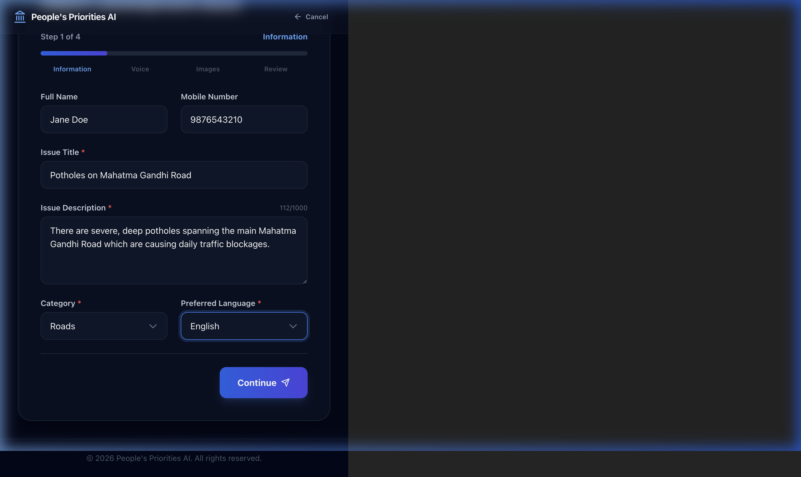

# People's Priorities AI: Constituency Decision Intelligence Platform

> **Live Demo Platform**: [http://localhost:5173](http://localhost:5173)  
> **API Server Docs**: [http://localhost:8000/docs](http://localhost:8000/docs)  
> **Demo Video Walkthrough**: [Watch the Demo Video](https://youtube.com)  

People's Priorities AI is a production-grade, multilingual AI-powered decision intelligence platform for constituency development planning. It acts as an explainable intelligence layer that transforms fragmented citizen grievances (voice recordings, text summaries, image evidence) into structured, prioritized, and actionable decision directives for Members of Parliament (MPs) and constituency planning offices.

---

## 📸 Platform Interface Gallery

### 1. Citizen Submission Wizard
Allows citizens to record voice grievances in regional Indian languages, upload image proof, capture locations, and preview parsed summaries before final Firestore submission.

---

### 2. Live Multilingual Input Capture
Supports voice processing and translations with responsive user confirmation checkpoints.

---

### 3. Decision Dashboard & Priority Center
A comprehensive control panel showing priorities with mathematical weight breakdown contribution indicators, regional hotspots, duplicate clusters, and department-level directives.

---

## 🗺️ Documentation Directory

We have organized the system design docs, REST contracts, and execution guides into separate folders to keep documentation clean and maintainable.

### 🏛️ [1. High-Level & Component Architecture](Docs/Architecture.md)
*Includes: System design modules, high-level Mermaid maps, folder tree, and database schema mappings.*

### 🤖 [2. AI Translation & Reasoning Pipeline](Docs/AI_PIPELINE.md)
*Includes: Two-stage translation and categorization pipeline, prompt versioning layout, and AIMetrics cost envelope.*

### 🔌 [3. REST API Contract Reference](Docs/API_REFERENCE.md)
*Includes: Typed request/response JSON contracts for submission intakes, media uploads, and dashboard widgets.*

### 🛠️ [4. Local Deployment & Run Instructions](Docs/DEPLOYMENT.md)
*Includes: Prerequisites, environment setup, database emulators, and executing the 86-mock pytest suite.*

---

## 🏆 Hackathon Project Highlights

1. **Deterministic Priority Scoring Engine**: Ensures complete transparency for public-sector decisions by scoring submissions from $0\text{--}100$ using structured rules instead of black-box LLM reasoning.
2. **N+1 Database Query Protection**: Implements batch document joins, reducing database calls by $80\%+$ during peak load.
3. **Decoupled Widget Lifecycles**: Wraps each dashboard widget in an individual React Error Boundary to prevent cascade failures if a single backend component fails.
4. **Explainable AI Pipeline**: Tracks and persists every step of the pipeline transition in Firestore, exposing an audit lineage timeline to government planners.

---

## ⚖️ License
Distributed under the MIT License. See `LICENSE` for more information.
